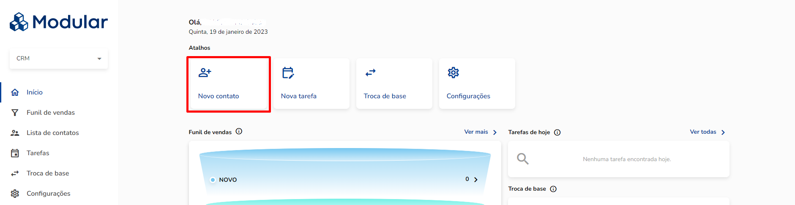

# FAQ Nave

Status: Não iniciada

## CRM ✅

- Como cadastrar um novo contato?
    1. Na página inicial, clique no atalho **Novo contato** localizado na parte superior da tela;
        
        
        
    2. Preencha as informações a serem cadastradas para este contato;
    3. Clique no botão **Salvar** no canto inferior direito.
- Como vincular um contato a outro corretor?
    1. Vincular novo contato
        1. Na página inicial, clique no atalho **Novo contato** localizado na parte superior da tela;
        2. Preencha as informações a serem cadastradas para este contato;
        3. No campo **Corretor**, selecione o nome do corretor a qual deseja vincular este contato;
        4. Clique no botão **Salvar**, no canto inferior direito.
    2. Vincular contato já cadastrado 
        1. No menu na lateral à esquerda, clique em **Lista de contatos;**
        2. Na lista, clique no nome do contato a qual deseja vincular um novo corretor. Ao selecionar o contato, você será direcionado para a tela de Resumo;
        3. Na tela Resumo, no canto superior direito, clique no botão **Opções** e depois em **Transferir contato;**
            
            
            
        4. A janela Transferência de contato será aberta. Nela, você irá selecionar o usuário que será responsável por este contato. Em seguida, selecione a etapa do funil para qual ele deverá ser enviado e a imobiliária.
            
            
            
        5. Após selecionar o usuário, etapa do funil e imobiliária, clique no botão **Transferir**, na parte inferior da tela.
- Como criar vínculo em um cadastro (vinculo de cônjuge, fiador, representante, procurador ou compra conjunta)?
    
    Você pode criar um vínculo em duas etapas diferentes do processo. A primeira etapa é quando está adicionando um novo contato. A segunda, é quando está editando os dados de um contato cadastrado. Vamos mostrar como criar um vínculo em para cada etapa a seguir.
    
    1. Vínculo para novo cadastro
        1. Na página inicial, clique no atalho **Novo contato** na parte superior da tela;
        2. Preencha as informações de cadastrado do contato;
        3. Na parte inferior da tela, na etapa Vínculos, clique no botão **Clique aqui para adicionar um vínculo**;
            
            
            
        4. A janela de Vínculos irá se abrir. Nela, você poderá selecionar o contato a ser vinculado ou realizar o cadastro de um novo vínculo;
        5. Para cadastrar um novo vínculo, clique no botão **Novo contato** e preencha as informações do vínculo;
        6. Após selecionar o vínculo cadastrado e o tipo de vínculo clique no botão **Adicionar**;
        7. Clique no botão **Salvar** no canto inferior direito.
    2. Vínculo para cadastro já existente
        1. No menu lateral à esquerda, clique em **Lista de contatos**;
        2. Selecione o contato para qual deseja criar o vínculo;
        3. Clique em **Dados do contato** na parte superior da tela.
            
            
            
        4. Na parte inferior da tela, na etapa Vínculos, clique no botão **Clique aqui para adicionar um vínculo;**
            
            
            
        5. A janela de Vínculos irá se abrir. Nela, você poderá pesquisar por nome, CPF ou CNPJ o contato já existente;
        6. Após selecionar o vínculo cadastrado e o tipo de vínculo clique no botão **Adicionar**;
        7. Clique no botão **Salvar** no canto inferior direito.
- Como criar uma nova tarefa?
    1. No menu na lateral à esquerda, clique em **Tarefas**;
    2. No canto superior direito, clique no botão **+ Nova tarefa;**
        
        
        
    3. Selecione o cliente vinculado a esta tarefa e preencha as demais informações;
    4. Clique no botão **Salvar** no canto inferior direito;
    5. Uma janela será aberta com uma notificação de Tarefa concluída com sucesso. Nesta janela, você também poderá selecionar se deseja criar uma nova tarefa.
- Devo encerrar minhas tarefas?
    
    Sim, recomendamos que você encerre suas atividades para que a sua agenda fique organizada. Assim, você terá uma gestão mais eficiente dos seus contatos e atendimentos realizados.
    
- Como encerar uma tarefa?
    1. No menu lateral à esquerda, clique em **Tarefas**;
    2. Vá até a tarefa que deseja encerrar e clique nos três pontinhos no canto superior direito da tarefa;
        
        
        
    3. Selecione a opção **Concluir** e a tarefa será encerrada.
- Como acompanhar tarefas?
    1. No menu lateral à esquerda, clique em **Tarefas**;
    2. No calendário, nos dias em que você possui uma tarefa agendada, haverá um ponto azul. No exemplo abaixo, está indicado nos dias 5, 16 e 23.
    Além disso, na lista lateral à direita, você também pode acompanhar as atividades em aberto e finalizadas.
    
    
    
- O que é um cadastro incompleto?
    
    Cadastro incompleto é um registro que ainda não possui todas as informações necessárias para avançar com a venda.
    
- Tenho um contato com cadastro incompleto e não consigo transformá-lo em pronto para proposta. O que fazer?
    
    Verifique se todas as informações a seguir estão preenchidas corretamente:
    
    - Nome do contato;
    - Data de nascimento;
    - CPF;
    - Estado civil;
    - Gênero;
    - E-mail, Telefone ou WhatsApp.
    
    Se após preencher todas essas informações e o cadastro ainda não estiver indicado como “*pronto para proposta*”, favor entrar em contato com a assistência técnica.
    
- O que é um cadastro pronto para proposta?
    
    Cadastro pronto para proposta é quando o cliente tem as informações mínimas necessárias para dar continuidade no processo da venda. São elas:
    
    - Nome do contato;
    - Data de nascimento;
    - CPF;
    - Estado civil;
    - Gênero;
    - E-mail, telefone ou WhatsApp.
- Tenho um contato com cadastro pronto para proposta, mas alguns dados não migraram para o SYS. O que fazer?
    1. Verifique se todas as informações do contato estão preenchidas corretamente no CRM;
    2. Verifique no histórico do cliente a mensagem de retorno de integração com o SYS. Deverá aparecer no histórico do sistema a mensagem: Cliente integrado com o SYS;
    3. Se as informações acima foram validadas, mas o cadastro ainda não foi encontrado no SYS, entre em contato com a assistência técnica.
- Como inativar e ativar um contato?
    1. No menu lateral à esquerda, clique em **Lista de contatos**;
    2. Clique no contato que deseja ativar ou inativar;
    3. Na tela de Resumo do contato, clique no botão **Opções** no canto superior direto;
    4. Depois, clique no botão **Ativar/Inativar contato**.
- Como solicitar e acompanhar uma troca de base?
    1. Solicitando a Troca de base
        
        Na criação de um novo cadastro, o sistema verifica se o contato já está cadastrado por meio dos dados: CPF, e-mail, telefone ou WhatsApp. Se o contato já estiver cadastrado, uma notificação vai informar a base original do contato.
        
        Preencha as informações de solicitação de Troca de base e clique no botão **Solicitar**;
        
    2. Acompanhar solicitação de Troca de base
        
        No menu lateral à esquerda, clique em **Troca de base**. Você será direcionado para uma tela com todas as solicitações que você já realizou e o status das suas solicitações.
        
        
        
- Como aprovar ou reprovar uma troca de base?
    1. No menu lateral à esquerda, clique em **Troca de base**;
    2. Em seguida, clique no botão **Ver detalhes**;
        
        
        
    3. Depois, clique na aba **Em aprovação** e você irá visualizar todas as solicitações de troca de base que estão aguardando aprovação;
        
        
        
    4. Analise a solicitação e clique no botão **Aprovar** ou **Reprovar**.
- Como realizar uma importação de base de contatos?
    1. Na tela inicial, clique no atalho **Novo contato**;
    2. No canto superior à direta, clique no botão **Importar contato**;
        
        
        
    3. No canto superior à direta, clique no botão **Planilha de exemplo** para baixar o modelo de importação;
        
        
        
    4. Preencha as informações da planilha conforme modelo;
    5. Para preencher o estado civil, copie o código como na classificação indicada na tabela de descrições de Campos excel como indicado na imagem abaixo;
    
    
    
    1. Após preencher a planilha, selecione uma roleta (caso a distribuição seja por roleta);
    2. Clique no botão **Selecionar planilha** e faça upload da sua planilha preenchida;
    3. Valide o retorno.
- Como adicionar uma observação no contato?
    
    Para contatos cadastrados você deverá ir em Lista de Contatos. Na lista, selecione o contato desejado e você será direcionado para a tela de Resumo. Nesta tela, vá até o campo Observações e adicione as informações desejadas. Ao terminar as edições, clique no botão **Salvar** no cantor inferior direito.
    
- O que é o histórico do contato?
    
    É o local em que você encontra tudo que foi feito no cadastro daquele contato.
    
    O Histórico está dividido em seis categorias, sendo elas:
    
    - Histórico de Tarefas: aqui você irá visualizar a timeline de todas as tarefas realizadas com este contato;
    - Histórico de Comentários: aqui você poderá ver todos os comentários adicionados a este cadastro;
    - Histórico de Sistema: aqui você poderá acompanhar todos os retornos do sistema como integrações e retorno do processo de crédito;
    - Histórico de Cadastro: aqui você terá acesso a timeline com todas as edições feitas no cadastro;
    - Histórico de Funil de vendas: aqui, você poderá acompanhar a evolução do cliente no funil de vendas;
    - Histórico de Troca de base: aqui você terá as informações sobre todas as trocas de base realizadas para este cadastro.
- Como configurar um cadastro de contato?
    1. No menu lateral à esquerda, clique em **Configurações**;
    2. Clique em **Cadastro de contatos**;
    3. Edite as informações de campos obrigatórios conforme desejado;
    4. Clique no botão **Salvar** no canto inferior direito.
- Como configurar troca de base?
    1. No menu lateral à esquerda, clique em **Configurações**;
    2. Clique em **Troca de base**;
    3. Realize as parametrizações conforme desejado;
    4. Clique em **Salvar** no canto inferior direito.
- Como configurar roleta?
    1. No menu lateral à esquerda, clique em **Configurações**;
    2. Clique em **Roleta**;
    3. No canto superior à direita, clique no botão **+ Criar nova roleta**, no canto superior direito;
        
        
        
    4. Preencha todas as informações necessárias e clique no botão **Salvar** no canto inferior direto.
- Como configurar campos de roleta?
    1. No menu lateral à esquerda, clique em **Configurações**;
    2. Clique em **Campos da roleta**;
    3. No canto superior direito, clique no botão **+ Criar novo campo**;
        
        
        
    4. Adicione as informações necessárias e clique no botão **Salvar** no canto inferior direito.
- Como configurar canais e subcanais?
    1. No menu lateral à esquerda, clique em **Configurações;**
    2. Clique em **Canais**;
    3. No canto superior direito, clique no botão **+ Criar novo canal**;
        
        
        
    4. Adicione o nome e a descrição do canal. Depois, clique no botão **Salvar** no canto inferior direito;
    5. Para cadastrar um subcanal, clique no botão **Adicionar subcanal**;
    
    
    
    1. Preencha as informações necessárias e clique no botão **Salvar** no canto inferior direito;
    2. Você pode adicionar quantos subcanais for necessário ao canal principal.
- Como configurar gestão de tarefas?
    1. No menu lateral à esquerda, clique em **Configurações**;
    2. Clique em **Gestão de tarefas**;
    3. No canto superior direito, clique no botão **+ Nova tarefa**;
        
        
        
    4. Dê um nome para a tarefa e selecione à qual etapa do funil ela corresponde. Depois, clique no botão **Salvar** no canto inferior direito.
- Como configurar gestão de funil?
    1. No menu lateral à esquerda, clique em **Configurações**;
    2. Clique em **Gestão de funil**;
    3. No canto superior direito, clique no botão **+ Adicionar nova etapa**;
        
        
        
    4. Preencha as informações necessárias e clique no botão **Salvar** no canto inferior direito.

## Vendas ✅

- Como localizar os empreendimentos disponíveis para a minha regional?
    
    No módulo Vendas, no menu lateral à esquerda, clique em **Empreendimentos**. Você será direcionado para uma tela com todos os empreendimentos disponíveis para a sua regional.
    
    
    
- Como identificar o status dos empreendimentos disponíveis para a minha regional?
    
    Na tela de Empreendimentos você encontrará uma lista com todos os imóveis disponíveis. Cada imóvel possuirá uma indicação com o status de cada empreendimento conforme a imagem abaixo.
    
    
    
- Como identificar o status das unidades de cada empreendimento?
    
    Na tela de Empreendimentos você poderá visualizar o status de todas as unidades de cada empreendimento. Os status são sinalizados por cor, conforme a imagem abaixo.
    
    
    
- Como visualizar documentos e arquivos de um empreendimento?
    1. No menu lateral à esquerda, clique em **Empreendimentos**;
    2. Clique no empreendimento sobre o qual você deseja obter informações;
    3. Depois, você poderá escolher entre Arquivos ou Mídias e visualizar as informações que precisa.
        
        
        
- Como identificar unidades livres?
    
    As unidades livres são indicadas pela cor verde. Você pode destacá-las aplicando o filtro na tela do espelho de vendas.
    
    
    
- Como criar um interesse para uma unidade?
    
    No espelho de vendas, vá até a unidade desejada. Depois, clique nos três pontinhos localizado no canto superior direito da unidade e selecione a opção **Criar interesse**;
    
    
    
    Você será redirecionado para a tela Gerar interesse. Nela, você poderá preencher as informações do contato com interesse na unidade selecionada. Para salvar o interesse, clique no botão **Gerar interesse** no canto inferior direito.
    
    
    
- Quantos interesses pode existir por unidade?
    
    Não existe um limite de interesses criados para uma unidade. Portanto, uma unidade pode ter mais de um interesse.
    
- Interesse é a mesma coisa que reserva?
    
    Não. O Interesse permite que outros corretores realizem ações na unidade selecionada. Por exemplo, é possível gerar proposta de venda ou criar um novo interesse para a unidade.
    Por outro lado, a unidade Reservada fica bloqueada para outras ações. Isto impede que outros corretores façam a venda da unidade reservada.
    
- Como reservar uma unidade?
    
    No espelho de vendas, vá até a unidade desejada. Depois, clique nos três pontinhos localizado no canto superior direito da unidade e selecione a opção **Reservar unidade**;
    
    
    
    Você será redirecionado para a tela Reservar unidade. Nela, você poderá preencher as informações do contato que está reservando a unidade selecionada. Para salvar a reserva, clique no botão **Reservar unidade** no canto inferior direito.
    
    
    
- Como simular uma proposta?
    
    No espelho de vendas, vá até a unidade desejada. Depois, clique nos três pontinhos localizado no canto superior direito da unidade e selecione a opção **Simulador de proposta**;
    
    
    
    Você será redirecionado para a tela Simulador de proposta. Nela, você poderá preencher as informações do contato para quem está simulando a proposta. Para salvar a simulação, clique no botão **Gerar proposta** no canto inferior direito.
    
    
    
- Como bloquear uma unidade?
    
    No espelho de vendas, vá até a unidade desejada. Depois, clique nos três pontinhos localizado no canto superior direito da unidade e selecione a opção **Bloquear unidade**. A unidade será bloqueada imediatamente.
    
    
    
- Como adicionar uma permuta a uma unidade?
    
    No espelho de vendas, vá até a unidade desejada. Depois, clique nos três pontinhos localizado no canto superior direito da unidade e selecione a opção **Adicionar permuta**. A unidade será atualizada como permuta imediatamente.
    
    
    
- Como criar uma proposta?
    
    No espelho de vendas, vá até a unidade desejada. Depois, clique nos três pontinhos localizado no canto superior direito da unidade e selecione a opção **Gerar proposta**;
    
    
    
    Você será redirecionado para a tela Gerar proposta. Nela, você poderá preencher as informações do contato para o qual está gerando a proposta de venda. Fique atento para preencher todas as informações corretamente.
    Para salvar a proposta, clique no botão **Gerar proposta** no canto inferior direito. 
    
    
    
- Quais os status possíveis de uma unidade?
    
    As unidades podem ter os seguintes status:
    
    - Livre: unidade livre para a comercialização;
    - Interesse: unidade com interesse marcado;
    - Reservada: unidade reservada por um contato;
    - Vendida: unidade vendida;
    - Pré-venda: unidades que iniciaram a esteira de venda;
    - Em aprovação: unidades que iniciaram a esteira de venda;
    - Permutante: unidade destinada para permuta.
- Como acompanhar o status de uma proposta?
    1. No menu lateral à esquerda, clique em **Lista de vendas**;
    2. Na lista de vendas, você poderá visualizar o status da proposta na primeira coluna. Os status são indicados por cor conforme a imagem abaixo;
        
        
        
    3. Ao selecionar a venda desejada, você também poderá acompanhar o histórico desta proposta. Para isto, clique no botão **Opções**, no canto superior direito.
    Depois, selecione **Histórico da Venda** e uma janela com os dados da venda será exibida.
    
    
    
- Como cancelar uma venda?
    1. No menu lateral à esquerda, clique em **Lista de vendas**;
    2. Selecione a venda desejada;
    3. Clique no botão **Cancelar venda**, no canto superior direito e a venda será cancelada.
- Como cancelar uma proposta?
    1. No menu lateral à esquerda, clique em **Lista de vendas**;
    2. Selecione a venda desejada;
    3. Clique no botão **Opções,** no canto superior direto;
        
        
        
    4. Depois, selecione a opção **Cancelar proposta**.
- O quer dizer venda com falha?
    
    A venda apresenta falha por dois motivos:
    
    1. A unidade selecionada já foi vendida através do SYS;
    2. O corretor indicado na venda não está corretamente parametrizado no HUB;
    
    Você pode consultar o histórico da venda para verificar o motivo da falha em ambas as situações.
    
- Posso editar uma proposta?
    
    Você pode editar a proposta enquanto ela ainda está no status em aprovação. Ao realizar as edições, ela será reencaminhada para aprovação do Gerente de House (GH).
    
- Como configurar etapas?
    1. No menu lateral à esquerda, clique em **Configurações**;
    2. Depois clique em **Etapas**;
    3. Selecione as ações desejadas para a etapa indicada;
    4. Clique no botão **Salvar** no canto inferior direito.
- Como configurar parâmetros gerais?
    1. No menu lateral  à esquerda, clique em **Configurações**;
    2. Depois clique em **Parâmetros gerais**;
    3. Selecione qual parâmetro você deseja ajustar;
    4. Preencha as informações conforme desejado e clique no botão **Salvar** no canto inferior direito.
- Como configurar tabela de preço?
    1. No menu lateral à esquerda, clique em **Configurações**;
    2. Depois clique em **Tabela de preço**;
    3. Você poderá criar uma nova tabela ou editar informações de tabelas já existentes;
    4. Selecione a tabela desejada ou clique no botão **+ Criar nova tabela de preços**.
        
        
        
    5. Preencha as informações desejadas e clique no **Salvar** no canto inferior direito.